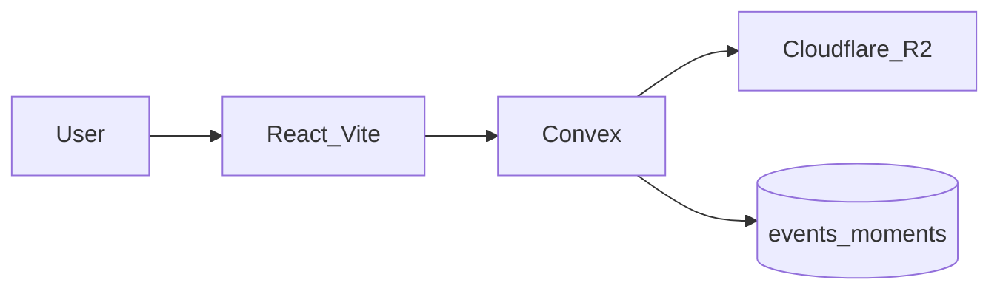
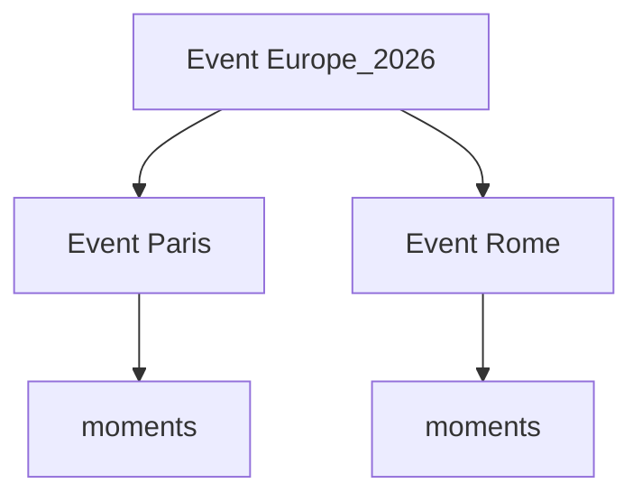

# What Happened — MVP feature plan

## Product

Personal **photo timeline**: upload photos, attach date/time/message, and group them into timelines using user-defined event types.

| Piece | Role |
| ----- | ---- |
| **Convex** | Auth (already v2), schema, queries/mutations/actions, realtime UI |
| **Cloudflare R2** | Photo object storage (presigned upload from Convex actions) |
| **Frontend host** | Convex static hosting (already recorded in `hackathon.md`) |

**Repo:** [saranatour1/What_Happened_Hackathon](https://github.com/saranatour1/What_Happened_Hackathon)

**Event types:** stored as strings on events and managed through each user's `customEventTypes` list. Seed Trip, Milestone, Everyday, and Other; users can add more.



## Current baseline

- Auth v2 username/password works; demo `numbers` table in `convex/schema.ts`.
- No R2 or static-hosting code yet.
- GitHub remote exists; **Project already exists** — [users/saranatour1/projects/10](https://github.com/users/saranatour1/projects/10/views/1?system_template=kanban) (Kanban). Issues still need to be created and added to it.
- `gh project` needs the `project` OAuth scope (`gh auth refresh -s project`) before item-add / link.

## Feature order (one ticket stream)

Build **strictly in this order**. Each feature = GitHub issue(s) that can ship independently.

1. **Board setup** — labels, milestones, link repo to **existing Project #10** (do not create a second project).
2. **Domain schema** — replace `numbers` with `users`, `events`, and `moments`; add Zod-backed Convex validation.
3. **Timeline UI shell** — chronological feed + create event; remove numbers demo.
4. **R2 photo upload** — configure R2, Convex action for presigned PUT, store object key + metadata on moment.
5. **Custom event types + type timelines** — user can add type strings; filter/group by `type`.
6. **Combine events** — nest under a parent and/or merge moments into one surviving event.
7. **Ship** — `@convex-dev/static-hosting`, public `.convex.site` URL, update `hackathon.md`.

## Combining events (how events relate to events)

Two operations, both kept:

1. **Nest (parent / child)** — several events belong under one umbrella without deleting them.
   Example: parent `"Europe 2026"` → children `"Paris"`, `"Rome"`.
   Field: optional `parentEventId` on `events`. Timeline can show the parent as a group and expand children. One level of nesting only in v1 (child cannot itself be a parent).

2. **Merge** — permanently combine two (or more) events into one.
   Mutation `mergeEvents({ survivingEventId, absorbedEventIds })`:
   - Re-points all `moments` to `survivingEventId`
   - Clears `parentEventId` links that pointed at absorbed events (or re-parents children to surviving)
   - Deletes absorbed event rows
   Use when the user duplicated an event or wants one card instead of many.



## Addable event types

- Seed `users.customEventTypes` with Trip, Milestone, Everyday, Other.
- User can append a normalized, unique type string.
- `events.type` must match one of the owner's type strings.
- Timelines filter on the `eventMembers.by_userId_and_eventType_and_eventStartsAt` index.

## Data model

### Schema (v2 — four tables, as implemented in `convex/schema.ts`)

```ts
users: defineTable({
  username: v.string(),
  name: v.optional(v.string()),
  image: v.optional(v.string()),
  customEventTypes: v.array(v.string()), // seeded + user-added
}).index("by_username", ["username"]),

events: defineTable({
  ownerUserId: v.id("users"),
  title: v.string(),
  type: v.string(), // must be one of the owner's customEventTypes (enforced in mutation)
  parentEventId: v.optional(v.id("events")),
  startsAt: v.number(),
  endsAt: v.optional(v.number()),
  timezone: v.optional(v.string()),
  notes: v.optional(v.string()),
}).index("by_ownerUserId_and_startsAt", ["ownerUserId", "startsAt"])
  .index("by_ownerUserId_and_type_and_startsAt", ["ownerUserId", "type", "startsAt"])
  .index("by_parentEventId_and_startsAt", ["parentEventId", "startsAt"]),

// Membership + a denormalized copy of the event's type/startsAt, so a
// member's timeline can be queried without joining back to `events`.
eventMembers: defineTable({
  eventId: v.id("events"),
  userId: v.id("users"),
  addedByUserId: v.id("users"),
  role: v.union(v.literal("owner"), v.literal("member")),
  eventStartsAt: v.number(),
  eventType: v.string(),
}).index("by_eventId_and_userId", ["eventId", "userId"])
  .index("by_userId_and_eventStartsAt", ["userId", "eventStartsAt"])
  .index("by_userId_and_eventType_and_eventStartsAt", ["userId", "eventType", "eventStartsAt"]),

moments: defineTable({
  userId: v.id("users"),
  eventId: v.optional(v.id("events")),
  r2Key: v.string(),
  contentType: v.string(),
  byteSize: v.optional(v.number()),
  takenAt: v.number(),
  message: v.optional(v.string()),
}).index("by_eventId_and_takenAt", ["eventId", "takenAt"])
  .index("by_userId_and_takenAt", ["userId", "takenAt"])
  .index("by_userId_and_eventId_and_takenAt", ["userId", "eventId", "takenAt"]),
```

Use `convex-helpers/server/zod` and `zod` for shared function argument schemas. Zod validates string length, trimming, finite timestamps, positive byte size, allowed MIME types, and date ordering before database writes. Convex schema validators remain the storage boundary.

**Deferred for later:** location fields, Firecrawl enrichment, reminders/AgentMail, separate `eventTypes` / `enrichments` tables, multi-user sharing, albums, comments, face tags, video, EXIF auto-parse, inbound email → create moment, and deep trees beyond one parent level.

## Post-v1 integrations

- **Firecrawl:** place, flight, and URL enrichment after the core timeline works.
- **AgentMail:** outbound event reminders after v1; no reminder table or mail workflow in this MVP.

## GitHub Project + tickets (execution deliverable)

**Existing board (locked):** [Project #10 — Kanban](https://github.com/users/saranatour1/projects/10/views/1?system_template=kanban)
Owner: `saranatour1` · Number: `10`

The board tracks the MVP first and keeps Firecrawl/AgentMail explicitly deferred.

### Labels

- `feature`, `infra`, `sponsor:r2`, `sponsor:firecrawl`, `sponsor:agentmail`, `sponsor:convex`, `hackathon`

### Milestones (map 1:1 to feature order)

- M1 Schema & timeline shell
- M2 R2 uploads
- M3 Custom types + combine events
- M6 Static hosting & submit prep

### Issues

| # | Title | Milestone | Labels |
| - | ----- | --------- | ------ |
| 1 | Configure repo labels/milestones and link Project #10 | — | `infra`, `hackathon` |
| 2 | Define three-table schema + Zod validators and remove numbers demo | M1 | `feature`, `sponsor:convex` |
| 3 | Build authenticated timeline UI shell (list + create event) | M1 | `feature`, `sponsor:convex` |
| 4 | Wire Cloudflare R2 + presigned photo upload | M2 | `feature`, `infra`, `sponsor:r2` |
| 5 | Attach date, time, and message to moments | M2 | `feature`, `sponsor:convex` |
| 6 | Addable event types + filter timelines by type | M3 | `feature`, `sponsor:convex` |
| 7 | Nest events under a parent + merge events | M3 | `feature`, `sponsor:convex` |
| 8 | Firecrawl place / flight / URL enrichment on events (post-v1) | Deferred | `feature`, `sponsor:firecrawl` |
| 9 | AgentMail event reminders (post-v1) | Deferred | `feature`, `sponsor:agentmail` |
| 10 | Deploy with Convex static hosting + update hackathon.md | M6 | `infra`, `sponsor:convex`, `hackathon` |

Each issue body will include: **Goal**, **Acceptance criteria**, **Out of scope**, **Depends on**.
Every issue will be added to Project **#10** (Kanban columns as Status allows).

### Commands (after `project` scope)

```bash
gh auth refresh -s project,repo
gh project link 10 --owner saranatour1 --repo saranatour1/What_Happened_Hackathon
# create labels + milestones on the repo
# gh issue create … then gh project item-add 10 --owner saranatour1 --url <issue-url>
```

Do **not** run `gh project create`.

## MVP boundaries

- No new GitHub Project
- No Firecrawl/AgentMail package installs
- No production deploy
- No Auth v2 redesign (keep current login)

## After tickets exist

Work **one open issue at a time** starting with the schema ticket (#2). Run `/hackathon` after each meaningful milestone.
