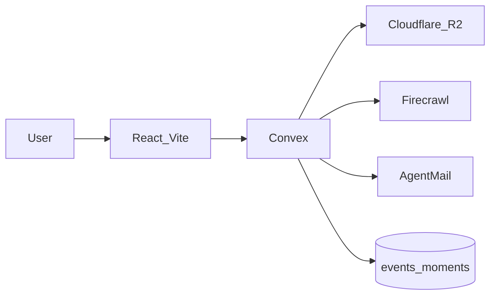
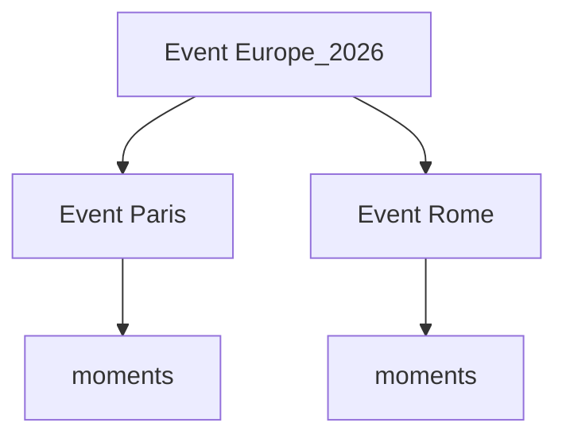

# What Happened — feature plan + GitHub tickets

## Product (locked)

Personal **photo timeline**: upload photos, attach date/time/location/message, group into **event-type timelines**, later enrich with web lookup and send reminders.

| Piece | Role |
| ----- | ---- |
| **Convex** | Auth (already v2), schema, queries/mutations/actions, realtime UI |
| **Cloudflare R2** | Photo object storage (presigned upload from Convex actions) |
| **Firecrawl** | Lookup/enrich places, flights, and other public details from a URL or search query |
| **AgentMail** | Outbound reminders (e.g. “trip in 3 days”, “anniversary tomorrow”) |
| **Frontend host** | Convex static hosting (already recorded in `hackathon.md`) |

**Repo:** [saranatour1/What_Happened_Hackathon](https://github.com/saranatour1/What_Happened_Hackathon)

**Event types:** user-defined via `eventTypes` (seed Trip, Milestone, Everyday, Other; user can add more).



## Current baseline

- Auth v2 username/password works; demo `numbers` table in `convex/schema.ts`.
- No R2 / Firecrawl / AgentMail / static-hosting code yet.
- GitHub remote exists; **Project already exists** — [users/saranatour1/projects/10](https://github.com/users/saranatour1/projects/10/views/1?system_template=kanban) (Kanban). Issues still need to be created and added to it.
- `gh project` needs the `project` OAuth scope (`gh auth refresh -s project`) before item-add / link.

## Feature order (one ticket stream)

Build **strictly in this order**. Each feature = GitHub issue(s) that can ship independently.

1. **Board setup** — labels, milestones, link repo to **existing Project #10** (do not create a second project).
2. **Domain schema** — replace `numbers` with `eventTypes`, `events`, `moments`, `reminders`, `enrichments`; keep Auth `users`.
3. **Timeline UI shell** — chronological feed + create event; remove numbers demo.
4. **R2 photo upload** — configure R2, Convex action for presigned PUT, store object key + metadata on moment.
5. **Custom event types + type timelines** — user can add types; filter/group by `eventTypeId`.
6. **Combine events** — nest under a parent and/or merge moments into one surviving event.
7. **Firecrawl enrich** — “Look up place / flight / link” action that stores enrichment rows on the event.
8. **AgentMail reminders** — schedule reminder for an event date; send via AgentMail from a Convex action/cron.
9. **Ship** — `@convex-dev/static-hosting`, public `.convex.site` URL, update `hackathon.md`.

## Combining events (how events relate to events)

Two operations, both kept:

1. **Nest (parent / child)** — several events belong under one umbrella without deleting them.
   Example: parent `"Europe 2026"` → children `"Paris"`, `"Rome"`.
   Field: optional `parentEventId` on `events`. Timeline can show the parent as a group and expand children. One level of nesting only in v1 (child cannot itself be a parent).

2. **Merge** — permanently combine two (or more) events into one.
   Mutation `mergeEvents({ survivingEventId, absorbedEventIds })`:
   - Re-points all `moments`, `reminders`, and `enrichments` to `survivingEventId`
   - Clears `parentEventId` links that pointed at absorbed events (or re-parents children to surviving)
   - Deletes absorbed event rows
   Use when the user duplicated an event or wants one card instead of many.



## Addable event types

Hardcoded `trip | milestone | …` is replaced by an **`eventTypes` table** owned by the user.

- Seed defaults on first login: Trip, Milestone, Everyday, Other (user can rename/hide later).
- User can **add** types anytime (`name`, optional `color`).
- `events.eventTypeId` references that row — timelines filter by type id, not a fixed union.
- Deleting a type is blocked while events still use it (or force-move those events to “Other”).

## Data model

### Is the first draft enough?

**Enough for a thin MVP** (create event → upload one photo → show chronological list). **Not enough for “real” reminders, reliable photo display, solid enrichment, custom types, or combining events** without the additions below.

| Gap | Why it matters |
| --- | -------------- |
| Photo is only `r2Key` | Need `contentType`, optional size, and a display URL strategy (presigned GET or public bucket prefix) |
| Location is only text | Fine for v1 notes; maps / “near me” later need optional lat/lng |
| No timezone | A trip photo “7pm” is ambiguous without `timezone` or stored local wall-clock fields |
| One `reminderAt` on the event | No sent/failed state, no AgentMail message id — you cannot safely retry or audit |
| One enrichment blob | Overwrites prior lookups; no kind (`place` vs `flight` vs `url`) |
| Fixed event type union | User cannot add types like `concert`, `wedding`, `flight` |
| No event↔event link | Cannot group a trip’s days or merge duplicates |
| `users` has only `username` | Reminders need a **destination email** (or you hardcode one inbox for demos) |

### Revised schema (plan target for ticket #2)

```ts
users: defineTable({
  username: v.string(),
  reminderEmail: v.optional(v.string()),
}),

// User-defined labels for timelines (addable)
eventTypes: defineTable({
  userId: v.id("users"),
  name: v.string(),
  color: v.optional(v.string()), // e.g. "#3B82F6"
  isArchived: v.boolean(),
  sortOrder: v.number(),
}).index("by_user_and_sortOrder", ["userId", "sortOrder"])
  .index("by_user_and_name", ["userId", "name"]),

events: defineTable({
  userId: v.id("users"),
  eventTypeId: v.id("eventTypes"),
  title: v.string(),
  // Nest under another event (one level). Omit for top-level.
  parentEventId: v.optional(v.id("events")),
  startsAt: v.number(), // UTC ms
  endsAt: v.optional(v.number()),
  timezone: v.optional(v.string()),
  locationText: v.optional(v.string()),
  locationLat: v.optional(v.number()),
  locationLng: v.optional(v.number()),
  notes: v.optional(v.string()),
}).index("by_user_and_startsAt", ["userId", "startsAt"])
  .index("by_user_and_type", ["userId", "eventTypeId"])
  .index("by_parent_and_startsAt", ["parentEventId", "startsAt"]),

moments: defineTable({
  userId: v.id("users"),
  eventId: v.id("events"),
  r2Key: v.string(),
  contentType: v.string(),
  byteSize: v.optional(v.number()),
  takenAt: v.number(),
  locationText: v.optional(v.string()),
  locationLat: v.optional(v.number()),
  locationLng: v.optional(v.number()),
  message: v.optional(v.string()),
}).index("by_event_and_takenAt", ["eventId", "takenAt"])
  .index("by_user_and_takenAt", ["userId", "takenAt"]),

reminders: defineTable({
  userId: v.id("users"),
  eventId: v.id("events"),
  sendAt: v.number(),
  status: v.union(
    v.literal("scheduled"),
    v.literal("sent"),
    v.literal("failed"),
    v.literal("cancelled"),
  ),
  toEmail: v.string(),
  subject: v.string(),
  bodyText: v.string(),
  agentMailMessageId: v.optional(v.string()),
  lastError: v.optional(v.string()),
}).index("by_status_and_sendAt", ["status", "sendAt"])
  .index("by_event", ["eventId"]),

enrichments: defineTable({
  userId: v.id("users"),
  eventId: v.id("events"),
  kind: v.union(v.literal("place"), v.literal("flight"), v.literal("url"), v.literal("other")),
  query: v.string(),
  sourceUrl: v.optional(v.string()),
  summary: v.string(),
  rawExcerpt: v.optional(v.string()),
  fetchedAt: v.number(),
}).index("by_event_and_fetchedAt", ["eventId", "fetchedAt"]),
```

**Still out of scope for v1 (do not ticket yet):** multi-user sharing, albums, comments, face tags, video, EXIF auto-parse, inbound email → create moment, deep trees beyond one parent level.

## Why AgentMail (in this product)

Convex stores *when* to remind you. It does **not** replace a mail provider. **AgentMail** is the piece that actually **sends email** from an app-owned inbox using an API designed for agents/apps.

Concrete use in “What Happened”:

1. You create a trip or milestone with `startsAt`.
2. App creates a `reminders` row (`sendAt` = e.g. 24h before).
3. A Convex cron/action finds due `scheduled` reminders.
4. The action calls **AgentMail** to send: “Tomorrow: Paris trip — 3 photos attached in your timeline.”
5. Store `agentMailMessageId` + mark `sent` (or `failed` + error).

Why not skip it?

- Without AgentMail (or another mail API), reminders only exist **inside the app** (toast/banner). Easy to miss.
- Email is the natural “future reference” channel when you are not opening the app.
- For the hackathon, AgentMail is a **sponsor surface**: judges can see a real outbound reminder path, not a stub `console.log`.

What AgentMail is **not** in this plan (unless you change it later): photo ingest via email, human support inbox, or replacing Auth.

## GitHub Project + tickets (execution deliverable)

**Existing board (locked):** [Project #10 — Kanban](https://github.com/users/saranatour1/projects/10/views/1?system_template=kanban)
Owner: `saranatour1` · Number: `10`

When you approve execution of **this plan**, do **only** labels/milestones + issues + add-to-Project-#10 first (no app feature code yet), unless you explicitly ask to start the schema ticket immediately after.

### Labels

- `feature`, `infra`, `sponsor:r2`, `sponsor:firecrawl`, `sponsor:agentmail`, `sponsor:convex`, `hackathon`

### Milestones (map 1:1 to feature order)

- M1 Schema & timeline shell
- M2 R2 uploads
- M3 Custom types + combine events
- M4 Firecrawl enrichment
- M5 AgentMail reminders
- M6 Static hosting & submit prep

### Issues to create (titles)

| # | Title | Milestone | Labels |
| - | ----- | --------- | ------ |
| 1 | Configure repo labels/milestones and link Project #10 | — | `infra`, `hackathon` |
| 2 | Define schema (`eventTypes`, `events`, `moments`, …) and remove numbers demo | M1 | `feature`, `sponsor:convex` |
| 3 | Build authenticated timeline UI shell (list + create event) | M1 | `feature`, `sponsor:convex` |
| 4 | Wire Cloudflare R2 + presigned photo upload | M2 | `feature`, `infra`, `sponsor:r2` |
| 5 | Attach date, time, location, message to moments | M2 | `feature`, `sponsor:convex` |
| 6 | Addable event types + filter timelines by type | M3 | `feature`, `sponsor:convex` |
| 7 | Nest events under a parent + merge events | M3 | `feature`, `sponsor:convex` |
| 8 | Firecrawl place / flight / URL enrichment on events | M4 | `feature`, `sponsor:firecrawl` |
| 9 | AgentMail event reminders | M5 | `feature`, `sponsor:agentmail` |
| 10 | Deploy with Convex static hosting + update hackathon.md | M6 | `infra`, `sponsor:convex`, `hackathon` |

Each issue body will include: **Goal**, **Acceptance criteria**, **Out of scope**, **Depends on**.
Every issue will be added to Project **#10** (Kanban columns as Status allows).

### Commands (after `project` scope)

```bash
gh auth refresh -s project,repo
gh project link 10 --owner saranatour1 --repo saranatour1/What_Happened_Hackathon
# create labels + milestones on the repo
# gh issue create … then gh project item-add 10 --owner saranatour1 --url <issue-url>
```

Do **not** run `gh project create`.

## What we will not do in the ticket-setup pass

- No new GitHub Project
- No R2/Firecrawl/AgentMail package installs yet
- No production deploy
- No Auth v2 redesign (keep current login)

## After tickets exist

Work **one open issue at a time** starting with the schema ticket (#2). Run `/hackathon` after each meaningful milestone.
